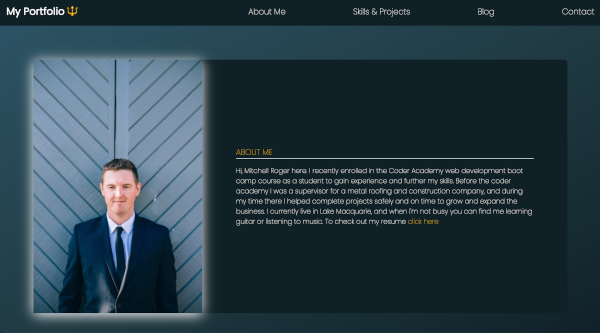
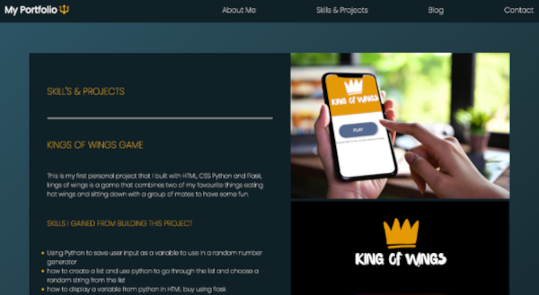
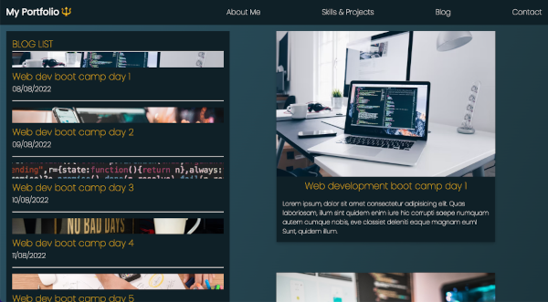
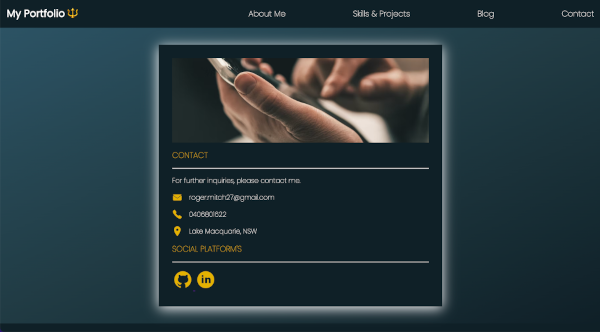

# My Portfolio

This is my portfolio and it shows off my skills and accomplishments. \
 Web site link [_here_](https://subtle-crepe-de62e8.netlify.app/). \
 Github repo [_here_](https://github.com/roger2727/MitchellRoger_T1A2).

## Table of Contents

- [General Info](#general-information)
- [Technologies Used](#technologies-used)
- [Features](#features)
- [Screenshots](#screenshots)
- [Project Status](#project-status)

## General Information

- This portfolio has an about me page, a skills and projects page, a blog page and a contact info page.
- The purpose of the portfolio is to show my skills using HTML and CSS to potential employers.
- I took on this project to have it go with my resume to get a job in web development.
- The project was also an assignment that was required from the coder academy boot camp course to get a diploma in IT.

## Technologies Used

- HTML (HyperText Markup Language)
- CSS (Cascading Style Sheets)
- jQuery (JavaScript Framework Library - commonly used in Ajax development)
- Deployment platform (Netlify)

## Features

- About page that had info about work history and a link to download resume
- Navigation bar with links to pages and a logo.
- Blog page that uses hyperlinks to direct you to the blog you want to read.
- Social media icons that link to my profiles.
- skills section that shows my project and a link to the repo
- Contact section with links to send an email, call my number and my location.

## Screenshots

## Project Status

Project is: In progress as I learn more Technologies I will implement them to improve my website and improve my skills
